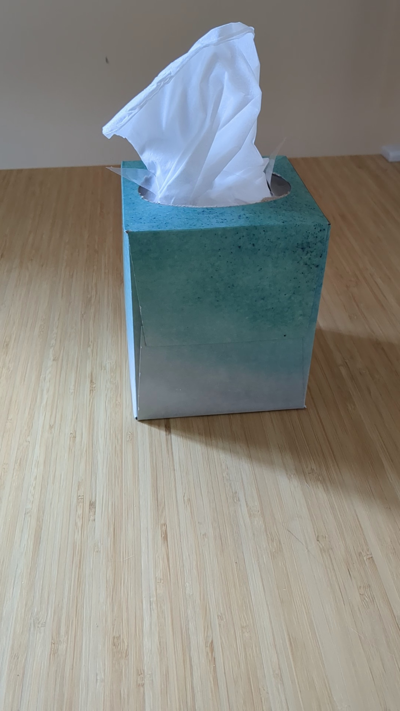
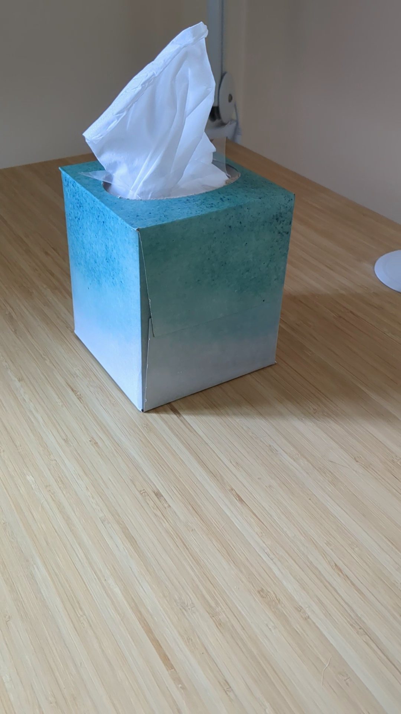
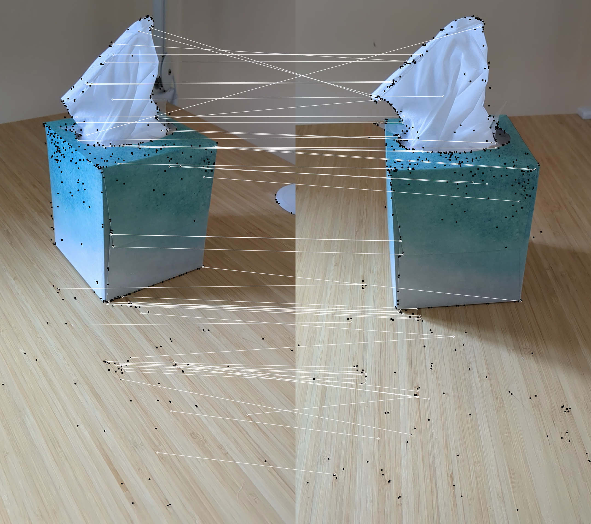
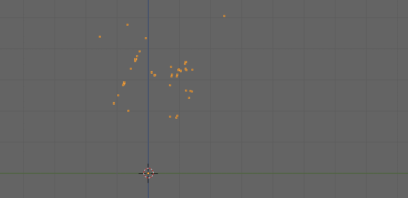
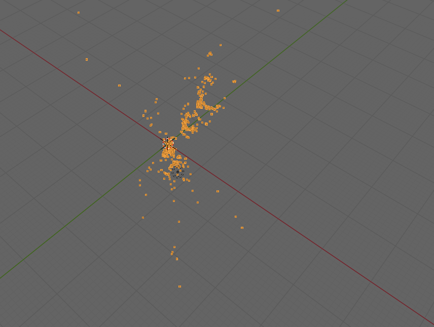
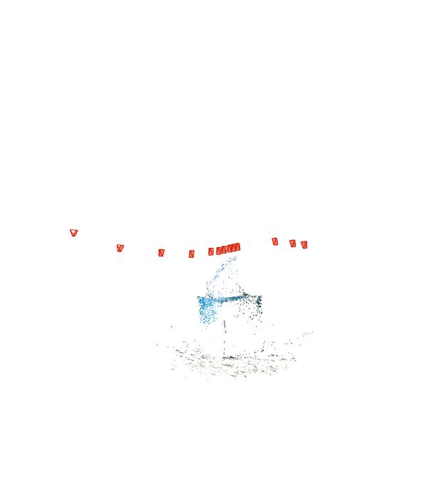
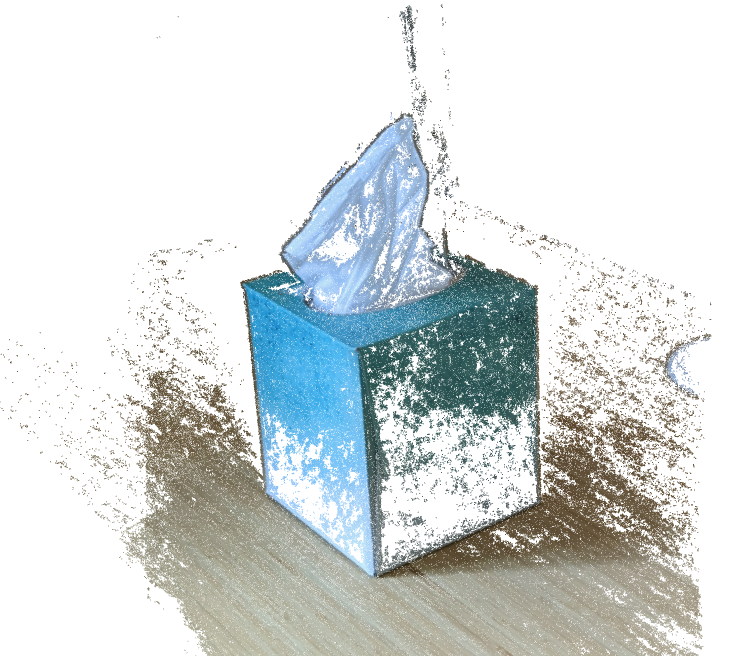

# Structure from motion exploration

With just two frames

feature matching

point cloud reconstruction is

With 13 frames it is

This is a very basic rudimentary SfM. For the same 13 input images [Colmap](https://github.com/colmap/colmap)
reconstructs both sparse and dense in 2-3 minutes, which is incredible in quality and speed:

## COLMAP classic
### Sparse 

### Dense (Poisson)

## Volumetric rendering

I ran the very same images and camera poses through NeRF and Gaussian Spatting. 

### NeRF
<video src="images/nerf-tiny.mp4" width="400" height="200" controls>  
  Your browser does not support the video tag.
</video>

### Gaussian Spatting
<video src="images/traj_tiny.mp4" width="400" height="200" controls>  
  Your browser does not support the video tag.
</video>

