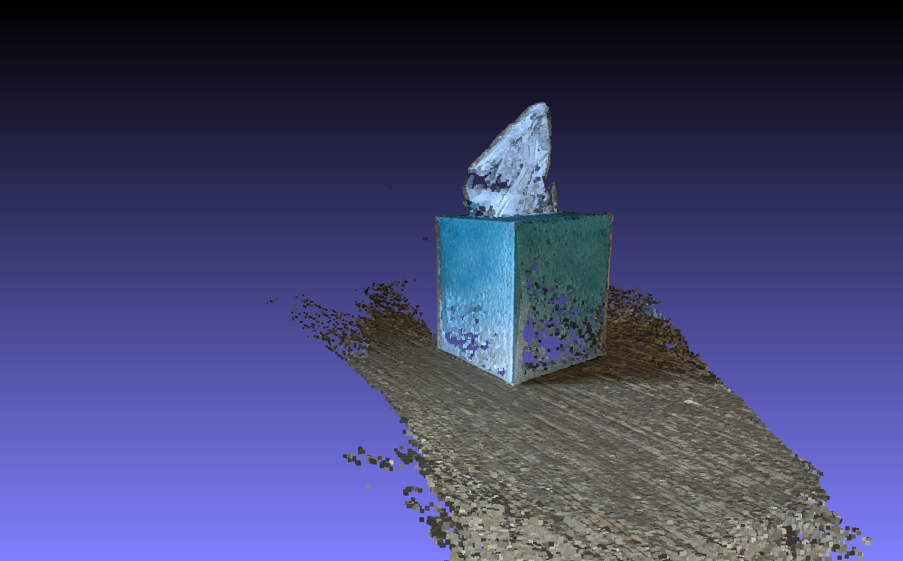

# Structure from motion exploration

With just two frames

feature matching

point cloud reconstruction is

With 13 frames it is

This is a very basic rudimentary SfM. For the same 13 input images [Colmap](https://github.com/colmap/colmap)
reconstructs both sparse and dense in 2-3 minutes, which is incredible in quality and speed:

**Sparse** 

**Dense**

## This comes with

* Chopping frames from video file
* Camera calibration
* Reconstruction (from frame directory to point cloud PLY)